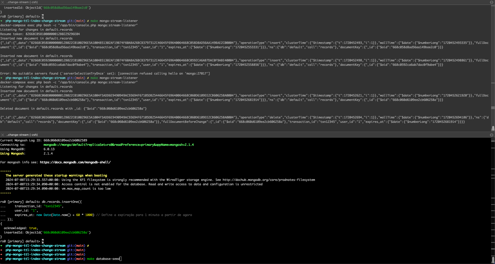

# PHP MongoDB TTL Index & Change Stream Listener Example

This repository provides an example PHP application showcasing the usage of MongoDB TTL indexes and change streams. It
includes a command-line script to listen for changes in MongoDB collections with TTL indexes, handling insert, update,
replace, and delete events.

## Features

- Demonstrates setting up TTL indexes for automatic document expiration.
- Illustrates using change streams to monitor collection changes in real-time.
- Handles various CRUD operations and tracks document changes efficiently.

## Requirements

- PHP >= 8.2
- MongoDB PHP Driver
- MongoDB server with replica set configured (for change streams)
- Docker

## Installation

1. Clone and navigate to the project directory:

   ```bash
   git clone https://github.com/your-username/php-mongo-ttl-index-change-stream-listener-example.git
   cd php-mongo-ttl-index-change-stream-listener-example
   ```

2. Start the project via make file setup command:

   ```bash
   make setup
   ```

   This command will install the project dependencies and set up the database via Docker.

## Usage

Run the listener command to start monitoring MongoDB collection changes:

```bash
php bin/console dev:mongo-stream-listener
```



Now all changes in the `records` collection will be displayed in the console output.

## Explore

Use make command to see all available commands:

```bash
> make

Usage: make [command]

Commands available:
  check-docker    Check if Docker is installed
  ci              Run the CI pipeline
  database-cleanup Cleanup the database
  database-migrate Migrate the database
  database-seed   Create a new record in the database
  help            Show this help message
  install-dependencies Install the project dependencies
  mongo-stream-listener Start the MongoDB stream listener
  playground      Start a PHP playground dockerized environment
  setup           Setup the project
  setup-database  Setup the database
  test            Run the tests
```

## License

This project is licensed under the MIT License - see the [LICENSE](LICENSE) file for details.
